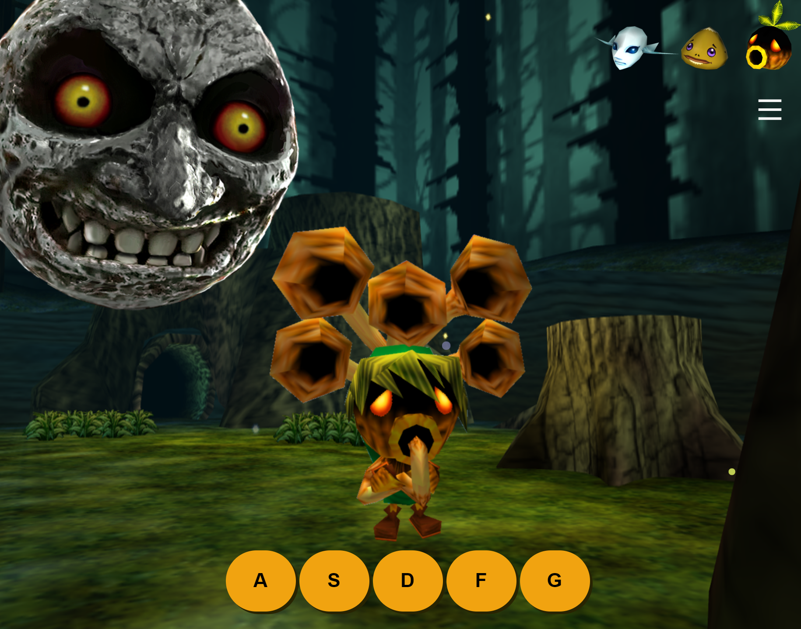

# zelda_instrument

Baseado no The Legend of Zelda: Majora's Mask, criei um site onde é possível tocar os intrumentos que o Link utiliza no jogo: Saxofone (Deku Link), Tambor (Goron Link) e Guitarra (Zora Link).

Utilize o mouse ou teclado para pressionar as teclas de comando e tocar as notas musicais. Caso pressione as notas na ordem correta, vai tocar um trecho da melodia.

Projeto original feito exclusivamente por mim do zero, usando apenas: JavaScript, HTML e CSS.

#

Ordem correta para tocar as melodias:

- D A S D A S - Song of time
- S A D S A D - Inverted song of time
- F D S F D S - Song of Healing
- A S G A S G - Song of Storms

Clique para acessar: https://jaysijj.github.io/zelda_instrument/

